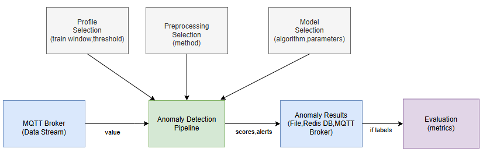

# AnomalyDSL 

This repository contains the implementation of **AnomalyDSL**, a Domain-Specific Language (DSL) 
for anomaly detection pipelines in streaming data.  

It was developed as part of my Diploma Thesis at the **School of Electrical & Computer Engineering, Aristotle University of Thessaloniki**.


## 📑 Table of Contents

- [Features](#features)  
- [Defining a Pipeline in AnomalyDSL](#defining-a-pipeline-in-anomalydsl)  
- [Installation](#installation)  
- [Usage](#usage)  
- [Testing the Pipeline](#testing-the-pipeline)  
- [Examples](#examples)  
  - [Custom Models](#custom-models)


## Features

- **Grammar definition** in [TextX](https://textx.github.io/textX/) (`anomaly.tx`).
- **Automatic code generation** using [Jinja2](https://jinja.palletsprojects.com/) (`generate_pipeline.py` + `pipeline_template.j2`).
- **Streaming anomaly detection** with [River](https://riverml.xyz/) as well as **custom detectors** .
- **Integration with MQTT** brokers and **Redis** for real-time anomaly detection pipelines.
- **Evaluation block** supporting Accuracy, Precision, Recall, F1-score, and ROC AUC metrics.
- **Example** `.anomaly` specification file and the corresponding **generated Python pipeline** are provided 
  to demonstrate the full workflow.

## Defining a Pipeline in AnomalyDSL

Pipelines in **AnomalyDSL** are declared in a single `.anomaly` specification file.  
Instead of writing Python code manually, the user defines the components of the pipeline in a **declarative way**.  
Each block describes one aspect of the pipeline (data source, preprocessing, model, evaluation, etc.).  
From this file, **AnomalyDSL automatically generates an executable Python script**.

The following diagram shows how the different blocks (Profile, Preprocessing, Broker, Model, Redis, Evaluation) interact to form an anomaly detection pipeline:



The **Preprocessing** block defines optional transformations (e.g., standard or min–max scaling) applied before anomaly detection to normalize the input stream and improve model performance.

```dsl
Preprocessing standard
    method: StandardScaler
end
```

The **Profile** block specifies high-level parameters for pipeline execution, such as the window size (initial data points used to train the model before anomaly detection starts) and the anomaly threshold (a quantile that adjusts sensitivity: values close to 1 detect only extreme anomalies, while lower values make the detector more sensitive and flag more cases).The anomaly threshold defines the cutoff point on the model’s anomaly score above which an observation is flagged as an anomaly.
The distinction between anomaly scores and binary alerts is valuable, as it allows both detailed analysis of anomaly intensity and clear-cut decisions for automated actions.

```dsl
Profile default
    window_size 1000
    threshold 0.80
end
```

The **Broker** block specifies the communication layer where data is published and consumed.  
At the moment, the DSL provides support for **MQTT**.

A full example configuration using a **remote MQTT broker with authentication** is shown below:

```dsl
Broker<MQTT> remote_broker
    host "your-broker-address.com"
    port 8883
    ssl: True
    auth:
        username: "my_user"
        password: "my_pass"
end
```
The **Redis** block allows storing anomaly scores and alerts for monitoring, persistence, or later analysis.

```dsl
redis_db my_redis
    host "localhost"
    port 6379
    db 0
    key_scores "anomaly_scores"
    key_alerts "anomaly_alerts"
end
```

The **Evaluation** block enables automatic assessment of the pipeline when ground-truth labels are available.  
It compares the detected anomalies against the true labels and computes standard metrics.

```dsl
Evaluation Eval
    data_file "input.csv"
    scores_file "results.csv"
    labels_file "labels.csv"
    anomalies_file "alerts.csv"
    metrics F1Score, Precision, Recall, Accuracy, ROCAUC
end
```

The **AnomalySpec** block defines the **final pipeline** by connecting all previously declared components.  
Multiple profiles, preprocessors, models, or brokers can be declared earlier, and in the `AnomalySpec` the user selects which ones to combine into a complete anomaly detection pipeline.


```dsl
AnomalySpec detectTemp
    broker local
    topic "machine/temperature"
    attribute "value"
    preprocessor standard
    model StandardAbsoluteDeviation
    profile default
    output "results.csv"
    alerts "alerts.csv"
    redis my_redis
end
```
In this example, anomaly scores are written to `results.csv` and alerts to `alerts.csv`.

The **output** and **alerts** blocks can also be configured to publish results back to a **broker topic**.  
This way, anomaly scores and alerts are streamed in real time into the messaging system and can be consumed by other applications.

Example (output to broker topic):

```dsl
output
    topic "machine/temperature/results"
    broker local
end
```
The alerts block can be configured accordingly, e.g.
publishing alerts to machine/temperature/alerts on the same broker.

The **model declaration** specifies the anomaly detection algorithm that will be used in the pipeline.  
AnomalyDSL provides support for the **main anomaly detection models of River**, as well as **custom detectors** defined by the user.

When the user does not provide explicit parameter values, the default values from River’s implementation are automatically applied.
This design offers flexibility, allowing pipelines to range from simple declarations (using defaults) to fine-tuned configurations (with carefully chosen parameters).

**1. StandardAbsoluteDeviation**  

This model does not take any numerical parameters.  
It calculates the anomaly score by using the deviation from the mean/median, divided by the standard deviation of all values seen in the data stream.

```dsl
model StandardAbsoluteDeviation
```
**2. GaussianScorer**
 
It takes as input the int value **window_size** (size of the recent value window used to fit the Gaussian distribution).

Since this model accepts only a single parameter, you do not need to specify the parameter name — just provide the value.

```dsl
model GaussianScorer
```
```dsl
model GaussianScorer(200)
```

**3. OneClassSVM**

It takes as input the float value **nu** (expected fraction of anomalies).

```dsl
model OneClassSVM
```
```dsl
model OneClassSVM(0.01)
```

**4. HalfSpaceTrees**

```dsl
model HalfSpaceTrees
```

```dsl
model HalfSpaceTrees(n_trees=25, height=15, window_size=250, seed=42)
```

⚠️ Note: In the current grammar for `HalfSpaceTrees`, parameters must follow the declared order  
(`n_trees → height → window_size → seed`).  
Because multiple parameters are supported, each one must be given explicitly in the form `name=value`.

For example:

```dsl
# valid (first and third argument)
model HalfSpaceTrees(n_trees=25, window_size=250)


# valid (only first two parameters)
model HalfSpaceTrees(n_trees=25, height=15)

# invalid (height before n_trees)
model HalfSpaceTrees(height=15, n_trees=25)
```

The same holds true for SNARIMAX which also has many parameters.

**5. SNARIMAX**

```dsl
model SNARIMAX
```

```dsl
model SNARIMAX(p=1,d=1,q=1)
```

```dsl
model SNARIMAX(
    p=2, 
    d=1, 
    q=2, 
    m=12, 
    sd=3, 
    regressor=LinearRegression, 
    preprocessor=standard, 
    learning_rate=0.01
)
```
⚠️ **Note:**  
The `regressor` option is included for completeness, as supported by River's SNARIMAX implementation.  
In univariate datasets (the typical case in AnomalyDSL), no exogenous variables are used, so the regressor does not affect the model.  
In this case, SNARIMAX behaves effectively as a seasonal ARIMA (SARIMA) online model.  

**6. CUSTOM**  
Users can implement their own detector in `models/CUSTOM_MODEL.py`.  
Depending on the detector type, the declaration changes:

⚠️ Note: Unlike River models (e.g., model GaussianScorer), custom models always require parentheses, even if empty. 
This makes clear the distinction between built-in River detectors and user-defined detectors.

- **Online mode** → no parameters required  
```dsl
model CUSTOM()
```
Batch mode → batch size must be provided

```dsl
model CUSTOM(100)
```

## Installation

### Prerequisites
- Python **3.9 – 3.12** (tested on Python 3.12.3)
- ⚠️ It is strongly recommended to use a **virtual environment**  
  (e.g. `python -m venv anomaly_env` and then `source anomaly_env/bin/activate`)  
  to keep dependencies isolated.  
- Once activated, you can run all scripts simply with `python ...`  
  (instead of `python3`), since the virtual environment ensures the correct version.

### Steps

1. **Clone the repository**
   ```bash
   git clone https://github.com/<username>/anomaly_dsl.git
   cd anomaly_dsl
   ```

2. **Install dependencies**
   - Minimal setup (DSL + streaming + core River models):
     ```bash
     pip install -r requirements-core.txt
     ```
   - Full setup (includes TensorFlow/Keras for custom deep learning models):
     ```bash
     pip install -r requirements-full.txt
     ```

## Usage

The user writes a DSL specification in the file `example.anomaly`.  
From this specification, the final executable Python pipeline is generated automatically.  
The process involves three steps:

1. **Validate the DSL specification (optional)**
   ```bash
   python validate_dsl.py
   
2. **Generate the Python pipeline from the DSL file**
   ```bash
   python generate_pipeline.py
   
3. **Run the generated pipeline**
   ```bash
   python anomaly_pipeline.py

With this process, the generated pipeline connects to the specified MQTT broker and waits for incoming values from the data stream.  
These values are processed in real time, and anomaly detection is performed automatically according to the DSL configuration.

## Testing the Pipeline

To test the generated pipeline, you can open a new terminal window and publish values to the broker topic.  

- In the `publishers/` folder, different publisher scripts are provided:
  - **HiveMQ publisher** (requires username/password authentication)
  - **Flespi publisher** (requires API token authentication)
  - **Localhost publisher** (no authentication, uses a local MQTT broker)

Each user can adapt the publisher according to their broker credentials.  

For the example setup in this repository, we use a **local MQTT broker**.  
You can run the publisher as follows:

```bash
python publishers/localhost_sender.py
```

This will stream values (e.g., from `data.csv`) to the topic defined in the DSL.  
The generated pipeline (running in another terminal) will consume these values and perform anomaly detection in real time.

The repository includes the well-known **Machine Temperature** dataset from the Numenta Anomaly Benchmark (NAB),  
placed directly alongside the publisher scripts.  
This dataset is commonly used for evaluating anomaly detection systems.  

If you want to test with different data, you can simply remove the existing `data.csv` file  
and replace it with your own dataset (keeping the same CSV format).


Once the publisher is running, the pipeline will operate in **real time**:  
- Incoming stream values are processed continuously.  
- Anomaly **scores** are calculated for each value.  
- **Alerts** are generated whenever anomalies are detected and published to the configured MQTT topic.  

These outputs can then be further utilized depending on the use case:  
- Published back into additional MQTT topics for downstream applications.  
- Stored in a **Redis database** for persistence, monitoring dashboards, or later analysis.  
- Written to local **files** (CSV) for logging and offline evaluation.

In this example, the pipeline subscribes to the raw sensor stream (`machine/temperature`) and performs anomaly detection in real time.  
The detected anomaly **scores** and **alerts** are then:  
- Stored in a local **Redis database** for fast access and monitoring.  
- Saved into local **files** (e.g., `alerts.csv`, `scores.json`) for logging and offline evaluation.

Since the dataset used here (NAB Machine Temperature) includes ground-truth labels,  
the DSL configuration also specifies an **Evaluation block**.  
This allows the system to compare predictions against the labels and calculate metrics such as Accuracy, Precision, Recall, F1, and ROC AUC.

When the anomaly detection process is running, you can stop it at any time with **`Ctrl + C`**.  
The system will then prompt you.If you confirm with **`y`**, the evaluation phase will be executed.  
The collected predictions and the ground-truth labels are compared,  
and the chosen metrics are printed in the terminal.


# Examples

Additional example DSL files are provided in the `examples/` folder.  
Users can experiment with the DSL by creating their own specifications,  
combining different components according to their needs.  

Following the same logic as in `example.anomaly`, a user may:  
- Select a different **broker** (e.g., HiveMQ, Flespi, or local MQTT).  
- Replace the default dataset with their own **data** and, if available, corresponding **labels**.  
- Configure various pipelines to work on different anomaly detection scenarios.

By editing the `example.anomaly` file, users can define different pipelines.  
This is the only DSL file that the code reads during execution,  
so any changes (e.g., broker, dataset, labels, detectors) should be made directly in this file  
before running the validation, generation, and execution steps.

## Custom Models

Custom detectors can be added in the `models/` folder.  
Each custom model must inherit from the base `AnomalyDetector` class and implement one of the following methods, depending on the mode:

- **Batch mode** → implement `handleBatch(values)`  
- **Online mode** → implement `handle_one(x)`

In both cases, the method should return:
- **score(s)** → a numerical anomaly score for each input  
- **flag(s)** → 1 if the input is considered an anomaly, 0 otherwise  

The detector is then declared in the DSL (`example.anomaly`) depending on its type:

- **Online mode** → declared simply by its name, without extra arguments.  
- **Batch mode** → declared with the batch size parameter, since this is required for processing data in chunks.  

All other hyperparameters are defined inside the custom detector’s code implementation.

By default, the `models/CUSTOM_MODEL.py` file already contains an example implementation:  
an **LSTM-based anomaly detection model** in batch mode.  

Additionally, two other lightweight examples are provided:  
- **simple_batch** → anomaly detection in batch mode (processes values in groups),  
  performing a simple threshold-based anomaly check.  
- **simple_one** → anomaly detection in online mode (processes values one by one),  
  also performing a simple threshold-based anomaly check.  

If you want to run your own detector as a custom model:  
1. Go to the `models/` folder.  
2. Copy the implementation of your model (e.g., `simple_batch.py`) into the file `CUSTOM_MODEL.py`.  
   - The `CUSTOM_MODEL.py` file serves as the entry point for any custom detector you want to test.
3. In the DSL (`example.anomaly`), declare the CUSTOM detector accordingly.

This way, the code generator will automatically include the detector defined inside `CUSTOM_MODEL.py` in the final pipeline.


